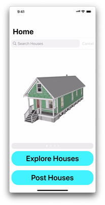
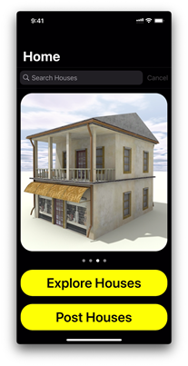
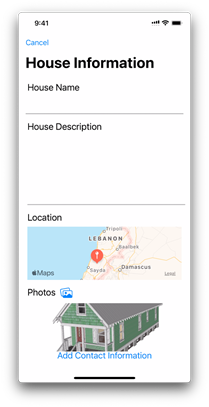
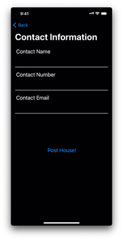
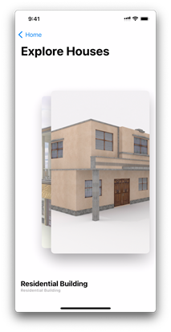
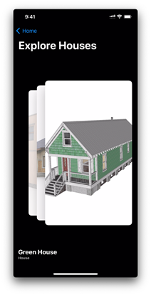
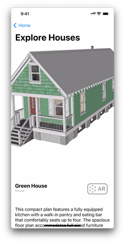
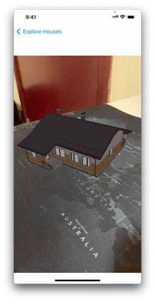
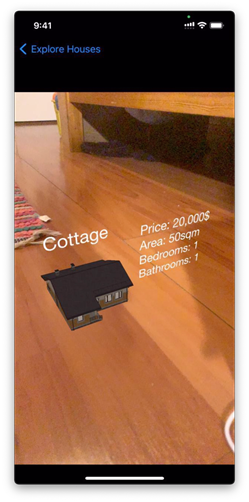

<h1> AR Home </h2>
CMPS 299 Final Year Project  
  
<i><b>Team Members:</b></i>
  Mohamad Ziad El Hamwi
  Farah Maria Majdalani
  Mohamad Knio

 
 

# Project Description:

AR Home is a real estate iOS application that gives you a more realistic experience while searching for your
next home. Using AR, the user can feel themselves as if the house is right in front of them, but even better.
Users are able to browse through the plethora of homes we have available on the app. In addition, they will be
able to view the interior of each house, along with a description of it, all in augmented reality.

 

# Components:

We designed our app exclusively for iOS at the moment so all work was handled within Xcode; we used ARKit in
conjunction with SceneKit as the main framework of our app.
  
We used numerous controllers throughout our app. These controllers help us organize our app’s controls, i.e. buttons,
image views, etc., in a specific way and we can exchange data between different controllers based on the user’s input on
the preceding controller. We also used a navigation controller within our app to allow easy navigation between the
different controllers.
  
Key Controllers:
<ul style="list-style: none;">
  <li>ViewController</li>
  <li>PostController</li>
  <li>CardSliderViewController</li>
  <li>ARViewController</li>
</ul>
 

<ul>
  <li>The <b>ViewController</b> is the main “home screen” of our app, it consists of numerous elements, including a 
collection view used to give the user a slidable/scrollable preview of the houses, a search bar, and some buttons to
interact with the app. </li>
  <li>The <b>PostController</b> handles the “PostHouses” portion of our app, it consists of a few text fields, to enter
information about the house the user is currently posting, an interactive map view imported from MapKit, a photo
selector (allows the user to either take a photo or upload an existing photo), as well as a button to take the user to
the next screen which prompts the user to enter his/her contact information.</li>
  <li>The <b>CardSliderViewController</b> initially came from a library, CardSlider, that we imported using Cocoapods. We
used it as a template to design our main interface to browse through houses. It can show an image preview of the
house, the title of the house, a description of the house, the price of the house, as well as a button to present the
house in augmented reality to the user. Pressing the AR button takes the user to the ARViewController.</li>
  <li>The <b>ARViewController</b> is the main view controller that presents the user with an AR view of the house, the user
can select whether he/she wants an interior or exterior view of the house and the app previews the house using AR
in the user’s desired way. It also handles tapping functionalities, i.e. when the user taps a house in AR, it presents
some useful information about the house; it displays them around the house using AR.</li>
</ul>

 

# Screen Mockups:

 

 

 

 

 

# Working Features:

Upon using the application, the user can use a variety of features:
<ul>
  <li>The user can scroll through an array of houses and get useful information about each house </li>
  <li>The user can tap on a house and view it in AR</li>
  <li>The user can tap a button which automatically takes them to the interior of the house or back to the
exterior </li>
  <li>The user will be able to enter a “Post House” form where they can specify the location of the listing, an
image, contact information, along with the basic house description. </li>

# Improvements:

There are certain features in our application that need improvement:
<ul>
  <li>Add a “contact buyer” feature under the information of each house </li>
  <li>Make the “Post House” view functional with a backend </li>
  <li>Make the search bar search between the houses in the database in the backend </li>
  <li>Make the AR experience more robust </li>
  <li>Allow the user to drag and move around the AR house within the plane </li>
  <li>Create an appropriate database in the backend that keeps track and stores all houses </li>
</ul>

# Future Components:

For the future we would like to add a few components that we see would improve the application:
<ul>
  <li>Create a database that contains information about the house listings we have. </li>
  <li>Filter houses according to location and price. </li>
  <li>Share the house information through WhatsApp or other social media platforms </li>
  <li>Mark the house as sold when the house gets sold. </li>
  <li>Post houses from the app into the database. </li>
  <li>Create an account for each user, where they can favorite and save the houses they view. </li>
  <li>Add contact information for each house where the user will be able to directly be in contact with the
owner/real estate agent. </li>
</ul>

# Lessons Learned:

Throughout this year, we have learned so much from starting this application. This application
strengthened our knowledge in Swift and iOS mobile programming. We also delved into a relatively new topic
for us, which is Augmented Reality. We learned how to anchor 3D objects on flat surfaces, display text on top
of the object, and even go inside the object to view its interior. We also learned how to add components to the
application's front end, both programmatically and using the storyboard. One other notable topic we learned
throughout this journey is using Cocoapods within our Xcode projects. It is a very powerful dependency
manager that gives us the ability to import third-party libraries into our project. We imported CardSlider and
used it as a template to design our main interface to browse through houses. We also experimented with
SwiftSoup initially, which allowed us to read data from online web pages and do some web scraping which was
helpful at first but later on, we decided to eliminate it since we felt that it wasn't essential for the key
functionality of our app which mainly is augmented reality. Hence, we decided to dedicate most of our
resources to improving the AR experience. Additionally, we learned how to create a GitHub repository for our
application that enabled easy access of the app between the group members.

